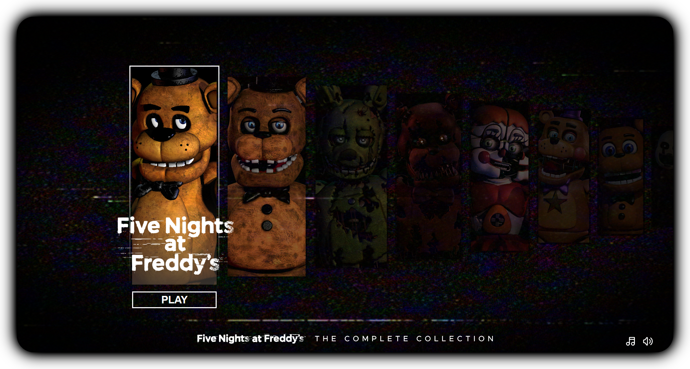

#  Five Nights at Freddy's Launcher
 A custom made fnaf launcher of the core games! 
 Huge credits to u/Whole-Ad-1768 for concept art and logos!

 

 ## Versions
__v1.1.2__ - HTML link changes 
__v1.1.1__ - Image changes 
__v1.1.0__ - Added a home screen, new game options, launchers and more! 
__v1.0.0__ - Main code with future updates planned!

 

## Features Planned

Click here to expand feature list

- [ ] __Fix logo change display bug!!__
- [ ] Add Credits screen
- [x] Add a Home screen
- [ ] Optimize js?
- [x] Implement cookies for remembering
- [x] Better/more sound design
- [ ] Add the loading screens
- [ ] Add mobile support

## Credits
 Fnaf logos and concept art - u/Whole-Ad-1768

>__Finally [here](https://irv77.github.io/FnafLauncher/) is the live version of the code!__